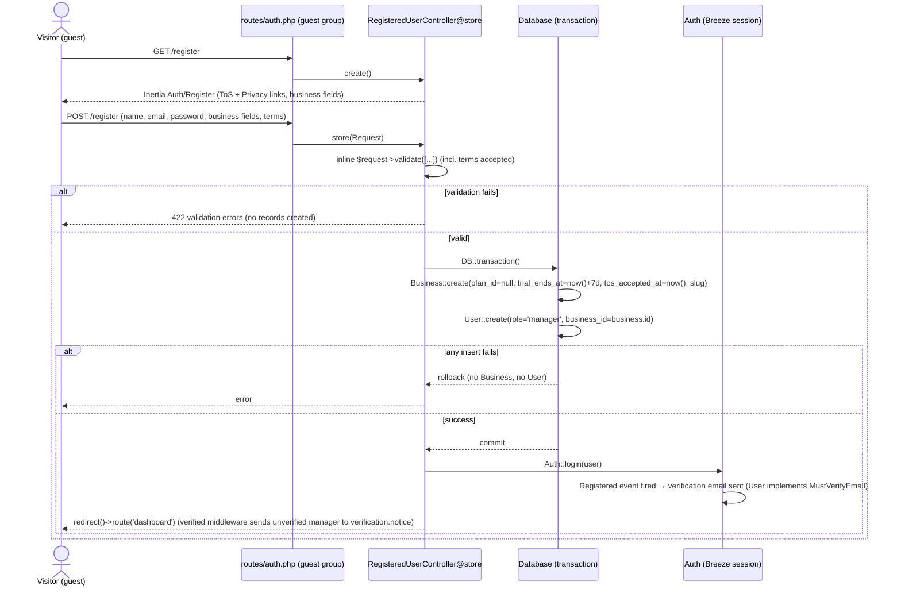
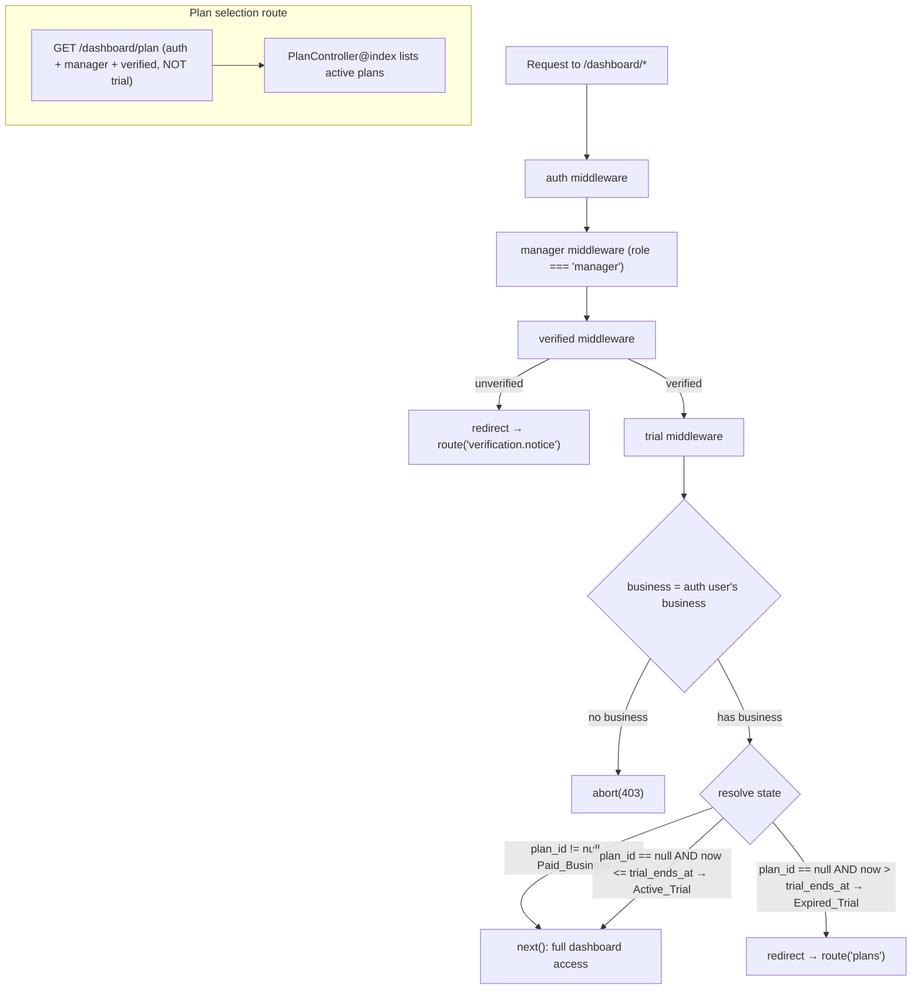
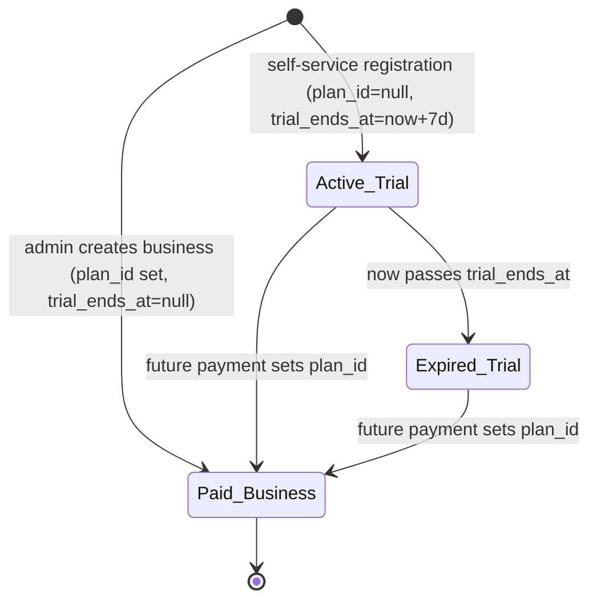

# Design Document

## Overview

This feature adds public, self-service registration to Slotify. A Visitor can register from a public page; the request creates one `Business` (tenant) and one manager `User` inside a single database transaction, records Terms of Service / Privacy Policy acceptance, and starts a 7-day free trial. During the trial the manager reaches the `/dashboard/*` area with basic-level feature access. When the trial expires with no paid plan, a new `Trial_Enforcement_Middleware` blocks the standard dashboard routes and redirects the manager to a plan-selection screen that lists active plans (no payment is processed here).

The design deliberately reuses the existing architecture rather than reworking it:

- **Auth** stays session-based (Breeze). A currently-missing piece is filled in: `routes/auth.php` imports `RegisteredUserController` but never registers register routes, and no app-level controller exists (only Breeze vendor stubs). This feature adds an app-level `App\Http\Controllers\Auth\RegisteredUserController` and the `guest`-group register routes.
- **Authorization** stays hand-rolled: role middleware (`admin`, `manager`) plus manual `business_id` ownership checks in controllers. A third small middleware (`trial`) is added in the same style. No Gates or Policies are introduced.
- **Trial state** is modeled as a separate state independent of `plan_id`: a business is in `Active_Trial`/`Expired_Trial` when `plan_id` is null and derived from a new `trial_ends_at` column; assigning a non-null `plan_id` later (the future payment feature) makes it a `Paid_Business` with no changes needed here. Because `plan_id` stays null during the trial, the existing capability gates (`isPremium()`, `canUse*()`) already return `false`, giving trials basic-level access with no change to those gates (Requirement 8.4).

Email verification is **in scope**: the `User` model implements Laravel's `MustVerifyEmail` contract so that the standard verification email is sent at registration, and dashboard access is gated by Laravel's existing `verified` middleware. This reuses the Breeze email-verification scaffold already present in the codebase (`EmailVerificationPromptController`, `VerifyEmailController`, `EmailVerificationNotificationController`) — it is a small addition, not an auth redesign (Requirement 12).

Out of scope: payment/billing, redesign of auth or tenancy. No new runtime dependencies (no Redis, no payment SDK).

## Architecture

### Registration flow



### Trial-enforcement request flow

`Trial_Enforcement_Middleware` (alias `trial`) sits **after** `auth`, `manager`, and Laravel's `verified` middleware on the dashboard route groups, so it only ever runs for an authenticated, email-verified manager. The `verified` middleware runs **before** `trial` so an unverified manager is redirected to the email-verification notice (`route('verification.notice')`, served by Breeze's `EmailVerificationPromptController`) before trial state is ever evaluated. Trial state is resolved server-side from the authenticated manager's **own** business and never consults another tenant.



State resolution is centralized on the `Business` model (see Components and Interfaces) so the middleware, the dashboard controller (for the UI banner), and tests all use one definition:

- **Paid_Business**: `plan_id` is not null (regardless of `trial_ends_at`).
- **Active_Trial**: `plan_id` is null AND `now <= trial_ends_at`.
- **Expired_Trial**: `plan_id` is null AND `now > trial_ends_at`.

The `Plan_Selection_Screen` route is guarded by `['auth','manager','verified']` but **not** `trial`, so an expired-trial manager can always reach it (Requirement 6.2) and the middleware can safely redirect to it without a loop. It **does** require `verified`: a manager must have a verified email to use the app at all, so an unverified manager is sent to the verification notice rather than the plans page.

### Placement of trial middleware on dashboard routes

`routes/dashboard.php` has two blocks, both currently `middleware(['auth','manager'])`. Both the `verified` middleware (before `trial`) and the `trial` alias are added to **both**:

- `GET /dashboard` (closure) → `['auth','manager','verified','trial']`
- `prefix('dashboard')` group (services, availability, appointments, schedule) → `['auth','manager','verified','trial']`

`verified` is placed before `trial` so an unverified manager is redirected to the email-verification notice before trial state is evaluated. The new plan-selection route is registered in the **same file** but outside those trial-guarded blocks, under `['auth','manager','verified']` only.

### Public booking flow is unaffected

The public booking routes live in `routes/web.php` under `/book/{business:slug}` and carry no `trial` middleware. This design intentionally leaves the public booking page live regardless of trial state (see Assumptions / Open Decisions). Trial enforcement applies only to `/dashboard/*`.

## Components and Interfaces

### 1. Database migration (new)

A **new** migration adds two nullable datetime columns to `businesses`. Existing applied migrations are not edited (per convention). SQLite locally / MySQL in production — both support `dateTime()->nullable()`.

`database/migrations/XXXX_XX_XX_add_trial_and_tos_to_businesses_table.php`

```php
public function up(): void
{
    Schema::table('businesses', function (Blueprint $table) {
        $table->dateTime('trial_ends_at')->nullable()->after('plan_id');
        $table->dateTime('tos_accepted_at')->nullable()->after('trial_ends_at');
    });
}

public function down(): void
{
    Schema::table('businesses', function (Blueprint $table) {
        $table->dropColumn(['trial_ends_at', 'tos_accepted_at']);
    });
}
```

**Placement of `tos_accepted_at` — Business vs User (decision):** The requirements allow either. This design places it on **`Business`**, alongside `trial_ends_at`, because:
- Consent is captured for the tenant/organization at the moment of registration, and the whole trial-state row lives on `Business`; co-locating keeps a single "registration provenance" record.
- Admin-created businesses (created without a registering user via the admin form) still have a coherent place for the field if consent is ever recorded there.
- It avoids touching the `User` fillable/`#[Fillable]` attribute set beyond what's already there.

The registering manager is discoverable via `business->users()->where('role','manager')` if per-user consent is ever needed later.

### 1a. `User` model change (email verification)

The `User` model implements Laravel's `MustVerifyEmail` contract so that the standard verification email is sent at registration and the `verified` middleware can gate dashboard access (Requirements 12.1, 12.2):

```php
use Illuminate\Contracts\Auth\MustVerifyEmail;

class User extends Authenticatable implements MustVerifyEmail
{
    // fillable/casts unchanged; verification uses the existing users.email_verified_at column
}
```

This is the only change to the `User` model — `$fillable` and `$casts` are otherwise unchanged, and verification state is stored in the standard `users.email_verified_at` column (no new column).

### 2. `Business` model changes

Add the two columns to `$fillable` and cast the datetimes. Add state-resolution helpers matching the glossary exactly. **Existing capability gates are left unchanged** (Requirement 8.4).

```php
protected $fillable = [
    'name', 'email', 'slug', 'phone', 'address', 'timezone',
    'is_active', 'plan_id', 'booking_window_days',
    'trial_ends_at',      // new
    'tos_accepted_at',    // new
];

protected function casts(): array
{
    return [
        'trial_ends_at'   => 'datetime',
        'tos_accepted_at' => 'datetime',
    ];
}

/** Business has a paid plan assigned (present or future payment feature). */
public function isPaid(): bool
{
    return ! is_null($this->plan_id);
}

/** plan_id null AND still within the trial window. */
public function onTrial(): bool
{
    return is_null($this->plan_id)
        && ! is_null($this->trial_ends_at)
        && now()->lessThanOrEqualTo($this->trial_ends_at);
}

/** plan_id null AND trial window has passed. */
public function trialExpired(): bool
{
    return is_null($this->plan_id)
        && ! is_null($this->trial_ends_at)
        && now()->greaterThan($this->trial_ends_at);
}

/** Remaining whole days of trial, floored at 0; null when not on a trial. */
public function trialDaysRemaining(): ?int
{
    if (is_null($this->trial_ends_at) || ! is_null($this->plan_id)) {
        return null;
    }
    return max(0, (int) ceil(now()->diffInDays($this->trial_ends_at, false)));
}
```

Note: a `Business` created by the admin flow has `plan_id != null` and `trial_ends_at == null`, so `isPaid()` is `true`, and `onTrial()`/`trialExpired()` are both `false` — it is treated as `Paid_Business` (Requirements 9.3, 4.4). During a self-service trial `plan_id` is null so `isPremium()` and the `canUse*()` gates already return `false`, yielding basic-level access without changing those methods (Requirements 5.2/5.3).

### 3. `RegisteredUserController` (new)

`app/Http/Controllers/Auth/RegisteredUserController.php`. Follows the project convention: inline `$request->validate([...])`, no Form Request. Uses `Password::defaults()` (the Breeze rule) so password requirements match the existing scaffold (Requirement 2.4). Uses `DB::transaction` for atomicity (Requirements 1.2, 1.8). Slug generation mirrors the admin flow (`Str::slug`, Requirement 1.5).

```php
namespace App\Http\Controllers\Auth;

use App\Http\Controllers\Controller;
use App\Models\Business;
use App\Models\User;
use Illuminate\Http\RedirectResponse;
use Illuminate\Http\Request;
use Illuminate\Support\Facades\Auth;
use Illuminate\Support\Facades\DB;
use Illuminate\Support\Facades\Hash;
use Illuminate\Support\Str;
use Illuminate\Validation\Rules\Password;
use Inertia\Inertia;
use Inertia\Response;

class RegisteredUserController extends Controller
{
    public function create(): Response
    {
        return Inertia::render('Auth/Register');
    }

    public function store(Request $request): RedirectResponse
    {
        $validated = $request->validate([
            'name'          => ['required', 'string', 'max:255'],           // manager name
            'business_name' => ['required', 'string', 'max:255'],           // tenant name
            'email'         => ['required', 'string', 'lowercase', 'email', 'max:255', 'unique:users,email'],
            'phone'         => ['nullable', 'string', 'max:255'],
            'timezone'      => ['required', 'string', 'max:255'],
            'password'      => ['required', 'confirmed', Password::defaults()],
            'terms'         => ['accepted'],                                 // ToS + Privacy acceptance
        ]);

        $now = now();

        $user = DB::transaction(function () use ($validated, $now) {
            $business = Business::create([
                'name'            => $validated['business_name'],
                'email'           => $validated['email'],
                'slug'            => $this->uniqueSlug($validated['business_name']),
                'phone'           => $validated['phone'] ?? null,
                'timezone'        => $validated['timezone'],
                'is_active'       => true,
                'plan_id'         => null,                    // Req 1.4 / 4.2 → Active_Trial
                'trial_ends_at'   => $now->copy()->addDays(7),// Req 4.1
                'tos_accepted_at' => $now,                    // Req 3.3
            ]);

            return User::create([
                'name'        => $validated['name'],
                'email'       => $validated['email'],
                'phone'       => $validated['phone'] ?? null,
                'password'    => Hash::make($validated['password']),
                'role'        => 'manager',                   // Req 1.3
                'business_id' => $business->id,               // Req 1.3 / 7.1
            ]);
        });

        Auth::login($user);                                   // Req 1.6
        // Auth::login (or the Registered event) fires the verification email because
        // User implements MustVerifyEmail (Req 12.1, 12.2). If not fired implicitly,
        // dispatch event(new Registered($user)) explicitly here.

        return redirect()->route('dashboard');                // Req 1.7 (verified middleware
                                                              // redirects unverified → verification.notice per Req 12.3)
    }

    private function uniqueSlug(string $base): string
    {
        $slug = Str::slug($base);
        $candidate = $slug;
        $i = 1;
        while (Business::where('slug', $candidate)->exists()) {
            $candidate = $slug . '-' . (++$i);
        }
        return $candidate;
    }
}
```

Notes:
- `terms` uses the `accepted` rule so an unchecked/false value is rejected with a validation error (Requirements 3.2, 3.4).
- `email` is validated `unique:users,email` to reject duplicates (Requirement 2.2) and `email` format (Requirement 2.3).
- `uniqueSlug` guarantees a unique slug even when two businesses share a name (Requirement 1.5); it extends, rather than contradicts, the admin flow's `Str::slug` approach.
- `password` uses `confirmed` + `Password::defaults()` to match the Breeze scaffold (Requirement 2.4).

### 4. Registration routes (add to `routes/auth.php`)

Inside the existing `Route::middleware('guest')->group(...)` block:

```php
Route::get('register', [RegisteredUserController::class, 'create'])
    ->name('register');

Route::post('register', [RegisteredUserController::class, 'store']);
```

The `RegisteredUserController` import already exists in the file; only the route registrations are added. This makes registration reachable by a guest and unreachable once authenticated (Requirement 1.1), consistent with Breeze.

**Breeze email-verification routes:** the standard Breeze verification routes — `verification.notice` (`EmailVerificationPromptController`), `verification.verify` (`VerifyEmailController`), and `verification.send` (`EmailVerificationNotificationController`) — must be registered and active in `routes/auth.php`. These ship with the Breeze scaffold; ensure they are present (they are what the `verified` middleware redirects to and what the resend action targets — Requirements 12.3, 12.5).

### 5. `Trial_Enforcement_Middleware` (new)

`app/Http/Middleware/EnsureTrialActive.php`, alias `trial`. Same minimal style as `EnsureUserIsManager`. It runs only after `auth`+`manager`, so `auth()->user()` is always a manager.

```php
namespace App\Http\Middleware;

use Closure;
use Illuminate\Http\Request;
use Symfony\Component\HttpFoundation\Response;

class EnsureTrialActive
{
    public function handle(Request $request, Closure $next): Response
    {
        $business = auth()->user()?->business;   // Req 7.3: only the manager's own business

        if (! $business) {
            abort(403, 'No business assigned to this user.');
        }

        // Paid_Business (incl. admin-created with null trial_ends_at) → full access.
        // Active_Trial → full basic-level access.
        if ($business->isPaid() || $business->onTrial()) {
            return $next($request);              // Req 5.1, 6.5, 8.2, 9.3
        }

        // Expired_Trial → redirect to plan selection.
        return redirect()->route('plans');        // Req 6.1, 6.3
    }
}
```

Registration in `bootstrap/app.php`:

```php
$middleware->alias([
    'admin'   => \App\Http\Middleware\EnsureUserIsAdmin::class,
    'manager' => \App\Http\Middleware\EnsureUserIsManager::class,
    'trial'   => \App\Http\Middleware\EnsureTrialActive::class,   // new
]);
```

Applied to both dashboard blocks in `routes/dashboard.php` as `['auth','manager','verified','trial']` — the `verified` middleware runs before `trial`, so an unverified manager is redirected to `route('verification.notice')` (Requirement 12.3) before trial state is considered. The plan-selection route is deliberately **not** in a `trial`-guarded group (but still requires `verified`), so an email-verified expired-trial manager reaches it and no redirect loop occurs (Requirement 6.2). State is resolved on the server for every protected request (Requirement 6.6).

### 6. Plan selection controller, route, and page

**Controller** `app/Http/Controllers/Dashboard/PlanController.php` (placed under `Dashboard/` to mirror the manager area it belongs to):

```php
namespace App\Http\Controllers\Dashboard;

use App\Http\Controllers\Controller;
use App\Models\Plan;
use Inertia\Inertia;
use Inertia\Response;

class PlanController extends Controller
{
    public function index(): Response
    {
        return Inertia::render('Dashboard/Plans', [
            'plans' => Plan::where('is_active', true)->get(),  // Req 6.4
        ]);
    }
}
```

**Route** (in `routes/dashboard.php`, guarded by `auth`+`manager`+`verified`, but **not** `trial`):

```php
Route::middleware(['auth', 'manager', 'verified'])
    ->get('/dashboard/plan', [\App\Http\Controllers\Dashboard\PlanController::class, 'index'])
    ->name('plans');
```

**Page/route placement justification:** the screen is a manager-area page and mirrors the `Dashboard/` controller namespace per the structure convention (Inertia pages mirror controller namespaces). So the controller is `Dashboard/PlanController` and the page is `Pages/Dashboard/Plans.vue`; the URL sits under `/dashboard/plan` (reachable when the rest of `/dashboard/*` is blocked, because this specific route omits the `trial` middleware). No payment is processed — the page lists active plans only.

### 7. Sharing trial status to the frontend (Req 5.4)

The trial banner needs remaining time. Rather than share it globally for every page, the dashboard closure in `routes/dashboard.php` (which already loads `$business`) adds a `trial` prop derived from the model helpers:

```php
'trial' => [
    'onTrial'        => $business->onTrial(),
    'expired'        => $business->trialExpired(),
    'isPaid'         => $business->isPaid(),
    'endsAt'         => $business->trial_ends_at,
    'daysRemaining'  => $business->trialDaysRemaining(),
],
```

`HandleInertiaRequests` continues to share `auth.user` and `flash` unchanged. If the banner is later needed on more manager pages, the same array can be moved into a shared prop in `HandleInertiaRequests` keyed on `auth()->user()?->business`; for this feature the dashboard-index prop satisfies Requirement 5.4. This keeps state server-derived (Requirement 6.6).

### 8. Frontend components

- **`Pages/Auth/Register.vue`** — start from the Breeze stub and extend: add a business-name field, timezone field, optional phone, and a required **terms** checkbox with inline links to the Terms of Service and Privacy Policy (Requirements 3.1, 3.2). The `useForm` payload becomes `{ name, business_name, email, phone, timezone, password, password_confirmation, terms }`. All labels/links use `t('...')` i18n keys. Wrapped in `GuestLayout`.
- **`Pages/Dashboard/Plans.vue`** — receives `plans`, lists each active plan (name, price) with a disabled/placeholder "choose" affordance (no payment). Wrapped in `ManagerLayout`. All strings via i18n.
- **`TrialBanner.vue` component** — shown in the manager area when `trial.onTrial` is true, displaying `trial.daysRemaining` via a pluralized i18n message; hidden for paid businesses. Reads the `trial` prop shared by the dashboard.
- **i18n** — add a new `register`, `trial`, `plans`, and `verifyEmail` (email-verification notice screen strings, per Requirement 12.8) namespace to `resources/js/i18n/locales/en.ts`, `ar.ts`, and `he.ts`, with identical key sets across all three (Requirements 10.1, 10.2, 10.4, 12.8). Arabic/Hebrew render RTL via the existing `document.dir` logic in `app.ts` (Requirement 10.3); no new RTL code is required.

## Data Models

### New columns on `businesses`

| Column            | Type              | Null | Default | Set by                                  | Notes |
|-------------------|-------------------|------|---------|-----------------------------------------|-------|
| `trial_ends_at`   | datetime          | yes  | null    | Self-service registration (`now()+7d`)  | Null for admin-created businesses (Req 4.4) |
| `tos_accepted_at` | datetime          | yes  | null    | Self-service registration (`now()`)     | Consent provenance for the tenant (Req 3.3) |

Both are cast to `datetime` (Carbon) on the `Business` model and added to `$fillable`. `plan_id` (existing, nullable FK to `plans`) is unchanged.

**Email verification is an access gate orthogonal to trial state.** `trial_ends_at` is set at registration (`now()+7d`) regardless of the manager's verification status (Requirement 12.6) — verification only gates dashboard *access*, it does not change *when* the trial clock starts. No new DB column is needed for verification: it uses the existing `users.email_verified_at` column. The standard Laravel `users` migration already includes `email_verified_at`, so typically no migration is required; if that column were absent, a small migration adding it would be needed.

### Trial state resolution (derived, not stored)

| State           | Condition                                              | Dashboard access | Capability level |
|-----------------|--------------------------------------------------------|------------------|------------------|
| `Paid_Business` | `plan_id != null`                                      | Full             | Per plan slug (existing gates) |
| `Active_Trial`  | `plan_id == null` AND `now <= trial_ends_at`           | Full (basic)     | Basic (all `canUse*()` false) |
| `Expired_Trial` | `plan_id == null` AND `now > trial_ends_at`            | Blocked → `plans` | n/a (locked out) |

### State transitions



Note there is no transition that clears `plan_id` back to null in this feature; the future payment feature owns paid-plan assignment.

## Error Handling

- **Validation errors (Req 2.1–2.4, 3.2):** inline `$request->validate([...])` throws `ValidationException`; Inertia converts it to a redirect back with errors bag. The `Register.vue` form surfaces `form.errors.*` next to each field (missing field → field-specific message; duplicate email → `unique` message; bad email → `email` message; weak/unconfirmed password → `Password::defaults()`/`confirmed` message; unaccepted terms → `accepted` message on `terms`).
- **No records on invalid input (Req 2.5, 1.8):** validation runs before the `DB::transaction`, so a validation failure never reaches `create()`. If an insert inside the transaction fails (e.g., a race on the unique email/slug), `DB::transaction` rolls back the whole closure, leaving neither a partial `Business` nor a partial `User`.
- **Missing business on a manager (defensive):** the trial middleware `abort(403)` if the authenticated manager has no business, matching the existing dashboard closure's guard.
- **403 vs redirect semantics:** role/tenant failures use `abort(403)` (consistent with `EnsureUserIsManager` and controller ownership checks). Trial expiration is **not** a 403 — it is a `redirect()->route('plans')`, because the manager is authorized but must choose a plan (Requirements 6.1, 6.3). This distinction is intentional and testable.
- **Redirect-loop safety:** the `plans` route omits the `trial` middleware, so redirecting an expired-trial manager there cannot loop.

## Correctness Properties

*A property is a characteristic or behavior that should hold true across all valid executions of a system — essentially, a formal statement about what the system should do. Properties serve as the bridge between human-readable specifications and machine-verifiable correctness guarantees.*

This design uses property-based testing because registration and trial-state resolution are input-driven server-side logic (varying registration payloads, varying clock positions relative to `trial_ends_at`, varying plan sets, varying tenant pairs). Non-varying route/redirect targets and no-change regressions are covered by example/edge tests in the Testing Strategy instead.

### Property 1: Valid registration creates correctly-linked records in Active_Trial

*For any* valid registration payload, submitting it creates exactly one `Business` (with `plan_id` null and in the `Active_Trial` state) and exactly one `User` whose `role` is `'manager'` and whose `business_id` equals the new business's id, and the new user is authenticated afterward.

**Validates: Requirements 1.2, 1.3, 1.4, 1.6, 4.2**

### Property 2: Registration persists trial and consent timestamps

*For any* valid registration payload submitted at any point in time, the created `Business` has `trial_ends_at` equal to the registration time plus 7 days and a non-null `tos_accepted_at` at approximately the registration time.

**Validates: Requirements 4.1, 3.3**

### Property 3: Slugs are unique and slug-consistent

*For any* sequence of successful registrations (including ones sharing the same business name), every resulting `Business` has a unique `slug` derived from the business name via the existing slug approach.

**Validates: Requirements 1.5**

### Property 4: Invalid input identifies the failing field

*For any* otherwise-valid payload with a single required field omitted, the response returns a validation error naming that field.

**Validates: Requirements 2.1**

### Property 5: Missing Terms/Privacy acceptance is rejected

*For any* otherwise-valid payload where Terms/Privacy acceptance is absent or false, the submission is rejected with a validation error on the acceptance field.

**Validates: Requirements 3.2, 3.4**

### Property 6: Invalid input creates no records (atomicity)

*For any* invalid registration payload (missing field, invalid or duplicate email, weak password, or missing acceptance), no `Business` and no `User` record is persisted.

**Validates: Requirements 2.5, 1.8**

### Property 7: Active-trial manager reaches the dashboard

*For any* clock time at or before a trial business's `trial_ends_at`, that business's manager can access the `/dashboard/*` routes.

**Validates: Requirements 5.1**

### Property 8: Trial grants basic-level access with no premium capabilities

*For any* business in the `Active_Trial` state, `isPremium()`, `canUseApprovalWorkflow()`, `canUseWhatsapp()`, and `canUseReminders()` all return false (basic-level access).

**Validates: Requirements 5.2, 5.3**

### Property 9: Remaining trial duration is exposed consistently

*For any* clock time before a trial business's `trial_ends_at`, the trial data shared to the dashboard reports a remaining-days value consistent with `trial_ends_at - now`.

**Validates: Requirements 5.4**

### Property 10: Expired-trial manager is blocked and redirected to plan selection

*For any* clock time after a trial business's `trial_ends_at`, that business's manager is blocked from every standard `/dashboard/*` route and redirected to the plan-selection screen.

**Validates: Requirements 6.1, 6.3**

### Property 11: Plan selection lists exactly the active plans

*For any* set of `Plan` records (mixing active and inactive), the plan-selection screen presents exactly the plans whose `is_active` is true.

**Validates: Requirements 6.4**

### Property 12: A non-null plan_id means full access regardless of trial_ends_at

*For any* value of `trial_ends_at` (past, future, or null), a business whose `plan_id` is not null resolves to `Paid_Business` and its manager has full `/dashboard/*` access.

**Validates: Requirements 6.5, 8.2, 9.3**

### Property 13: Tenant isolation is preserved

*For any* two distinct businesses A and B, a manager of A cannot read or modify a resource owned by B, and B's data is unchanged by the attempt.

**Validates: Requirements 7.1, 7.2, 7.3, 7.4, 7.5**

### Property 14: New localization keys exist and are synchronized

*For any* new user-facing message key introduced by this feature, that key exists with a non-empty translation in each of the `en`, `ar`, and `he` locale files, and the three locales share an identical key set for the new namespaces.

**Validates: Requirements 10.1, 10.2, 10.4**

### Property 15: Email verification gates dashboard access

*For any* manager whose email is unverified, requesting any `/dashboard/*` route redirects to the email-verification notice (`route('verification.notice')`) and never reaches the dashboard; *for any* manager whose email is verified, the same request reaches the dashboard subject to the trial state (Active_Trial/Paid → allowed, Expired_Trial → redirected to plan selection).

**Validates: Requirements 12.3, 12.4, 11.6**

## Testing Strategy

**Frameworks and conventions:** PHPUnit 12 feature tests using `RefreshDatabase`; run with `php artisan test` / `composer test` (Requirement 11.7). Use the existing `BusinessFactory` (default `plan_id => null`, add a `trial()` state and reuse `premium()`), `UserFactory`, and `PlanFactory`. Trial-time behavior uses **Carbon test-time travel** (`$this->travel(...)->days()` / `Carbon::setTestNow(...)`), never real sleeping, so `trial_ends_at` comparisons are deterministic.

**Property-based testing note:** the codebase has no PHP PBT library and this feature should not add new dependencies. The properties above are therefore realized as **data-provider-driven PHPUnit tests** — each property runs across a representative set of generated/enumerated inputs (multiple valid payloads, each required field omitted in turn, several clock offsets before/after expiry, multiple plan-set shapes, multiple tenant pairs) rather than a single example. This satisfies the intent of comprehensive input coverage within the project's existing toolchain. Each such test carries a comment tag:

`// Feature: business-registration-trial, Property {number}: {property_text}`

### Property tests (one focused test per property)

- **P1/P2** `RegistrationTest`: happy path — for several valid payloads, assert exactly one `Business` + one manager `User` linked, `plan_id` null, `onTrial()` true, `trial_ends_at == now()->addDays(7)` (freeze time), `tos_accepted_at` set, and `assertAuthenticatedAs($user)`.
- **P3** slug uniqueness — register several businesses with the same name; assert all slugs unique and each is `Str::slug`-consistent.
- **P4** per-field validation — data provider omitting each required field; assert `assertSessionHasErrors([field])`.
- **P5** terms required — omit/false `terms`; assert error on `terms`.
- **P6** no-records atomicity — data provider of invalid payloads (missing field, dup email, bad email, weak password, missing terms); assert `Business::count()` and `User::count()` unchanged.
- **P7** active-trial access — travel to several times before `trial_ends_at`; acting as the trial manager, GET dashboard routes → 200.
- **P8** capability level — for a trial business, assert `isPremium()` and all `canUse*()` return false.
- **P9** remaining duration — travel to several pre-expiry times; assert the shared `trial.daysRemaining` matches the expected computed value.
- **P10** expired block+redirect — travel past `trial_ends_at`; acting as the trial manager, GET each protected dashboard route → redirect to `route('plans')`.
- **P11** plan listing — seed active + inactive plans; GET `route('plans')` → page `plans` prop contains exactly the active ones.
- **P12** paid full access — for `trial_ends_at` in {past, future, null} with a non-null `plan_id`, acting as that manager, GET dashboard routes → 200.
- **P13** tenant isolation — manager of business A attempts to confirm/reject an appointment (and read a service) owned by business B → denied (403/404) and B's records unchanged.
- **P14** i18n parity — a test asserting the new key namespaces have identical, non-empty keys across `en/ar/he` (implemented as a PHP test reading the locale files, or a lightweight JS/TS check depending on tooling; if only PHPUnit is used, assert the shared key list via a fixture of expected keys).
- **P15** email-verification gate — data provider over verified/unverified manager states: an unverified manager GETting each protected `/dashboard/*` route → redirect to `route('verification.notice')` (use `User::factory()->unverified()`); a verified manager (`email_verified_at` set) → reaches the dashboard when on trial/paid, and is redirected to `route('plans')` when the trial is expired (Carbon time-travel past `trial_ends_at`). Uses `RefreshDatabase` and `actingAs`.

### Example / edge / regression tests

- **1.1 / 1.7 (EXAMPLE):** guest GET `/register` → 200; valid POST → redirect to `route('dashboard')`.
- **2.2 (EXAMPLE):** seed a user with an email, register with the same email → `email` error, no new records.
- **2.3 / 2.4 (EDGE):** a few malformed emails and a too-short/unconfirmed password → validation errors, no records.
- **3.1 (EXAMPLE):** register page exposes ToS/Privacy links (assert via component/props or presence of i18n keys).
- **4.4 / 9.3 (EXAMPLE):** admin creates a business → `trial_ends_at` null, `plan_id` non-null, resolves to `Paid_Business`; that manager reaches the dashboard.
- **6.2 (EXAMPLE):** expired-trial manager GET `route('plans')` → 200 (not redirected).
- **8.4 (EXAMPLE):** a premium business still returns true for `canUse*()` — gate methods untouched.
- **9.1 / 9.2 (EXAMPLE, regression):** admin business `store` still creates business + branding; admin `store` without `plan_id` → validation error.
- **10.3 (EXAMPLE/manual):** with locale `ar`/`he`, new pages render under the existing RTL `document.dir` logic.

These example/edge/regression tests plus the property tests above collectively satisfy the mandated test set in Requirement 11 (11.1 registration happy path with 7-day trial; 11.2 invalid input incl. duplicate email and missing acceptance create no records; 11.3 active-trial dashboard access; 11.4 expired-trial block + redirect; 11.5 tenant isolation; 11.6 unverified manager redirected to the verification notice and verified manager reaches the dashboard — see P15; 11.7 run under PHPUnit).

## Assumptions / Open Decisions

Two product decisions from the requirements' Open Questions are **not yet confirmed**. This design implements the requirements' recommended defaults, but they are called out here so the user can still change course before implementation.

1. **Trial = separate state with basic-level access (Open Question 1, default c+b).** Assumed: the trial is a distinct state (`plan_id` stays null, tracked by `trial_ends_at`), and during the trial the business gets basic-level features (all premium `canUse*()` gates false). The middleware and `Business` helpers are designed around this. If the user instead wants premium-level trial features, `EnsureTrialActive` would remain the same but the capability gates would need a trial-aware branch — a localized change.

2. **Post-expiration lockout except plan selection (Open Question 2, default a).** Assumed: an expired-trial manager is locked out of standard `/dashboard/*` and redirected to the plan-selection screen; no read-only dashboard. If a read-only mode is later chosen, it would be an additive middleware/route change.

3. **Public booking page behavior after expiry is UNDECIDED (Open Question 2 sub-question).** This design leaves the public booking page (`/book/{slug}`) **unaffected** by trial enforcement — the `trial` middleware applies only to `/dashboard/*`, so an expired business's public page stays live and the page is **not** silently disabled. If the user decides expired businesses' public pages should be gated, that can be added later as a targeted check in `BookingController@show` (e.g., 404/"unavailable" when `trialExpired()` and not paid) plus a new acceptance criterion; nothing in this design blocks that follow-up.

No new dependencies are introduced (no Redis, no payment SDK), no existing authorization is weakened, and the admin-created business flow and existing `admin`/`manager` middleware behavior are preserved.
