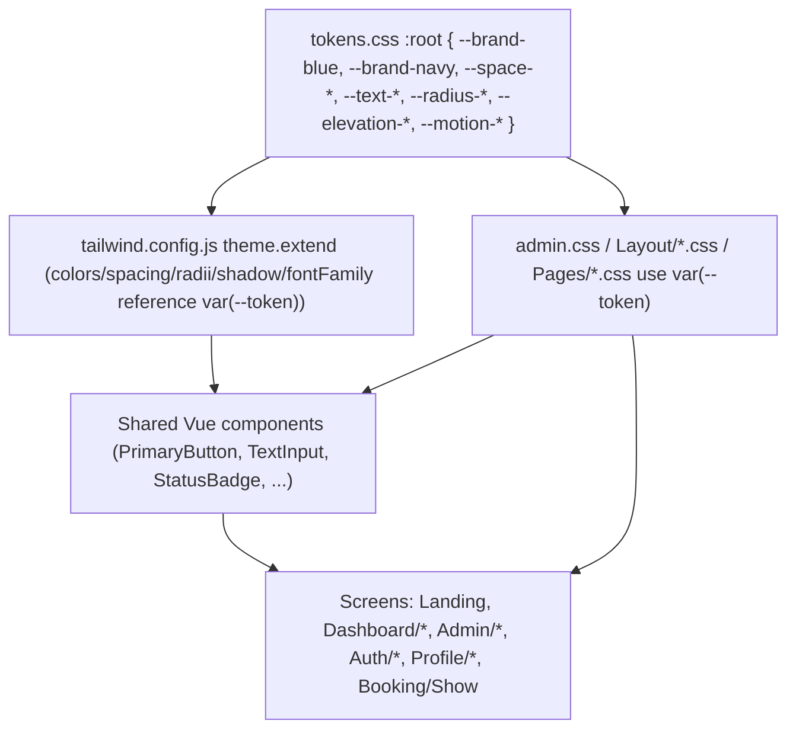
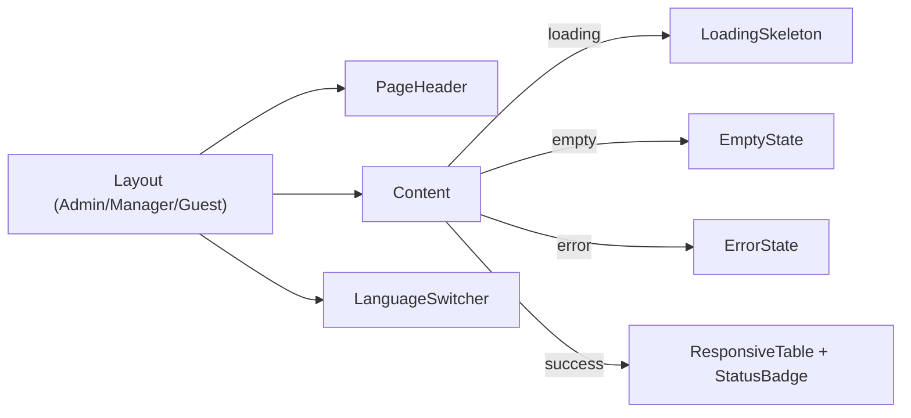
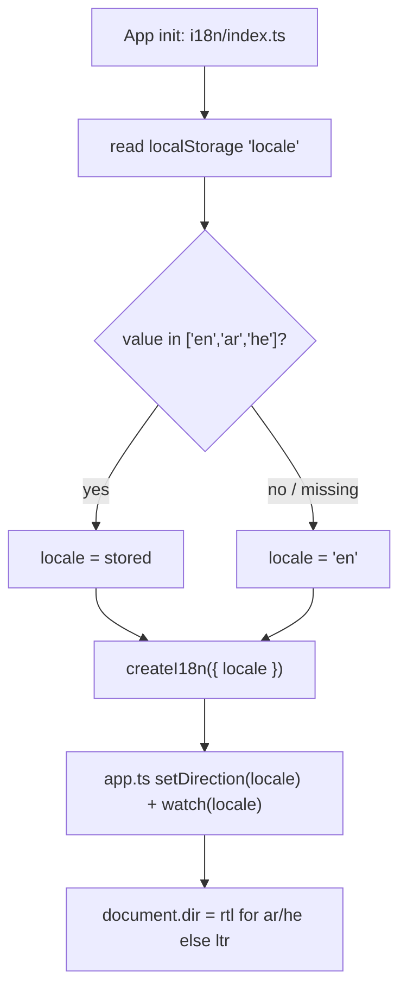

# Design Document: v1 UI/UX Refresh

## Overview

The v1 UI/UX Refresh unifies the visual language of iRestTOR (Slotify) across every surface — landing page, manager dashboard, admin console, authentication/profile screens, and the public booking flow — while keeping the change strictly frontend/UI. No backend file, controller behavior, route, authorization check, tenant scoping, or data model is modified (Requirement 1).

The core problem is fragmentation, not a missing design. The codebase already has the seed of a design system: `resources/css/admin.css` defines a `:root` block of custom properties (`--admin-navy: #071533`, `--admin-blue: #2563ff`, `--admin-bg`, `--admin-card`, `--admin-border`, `--admin-text`, `--admin-muted`). The fragmentation comes from three sources:

1. **Two competing brand blues** — page-level CSS files hardcode literals instead of consuming the token: `#2563ff` appears in `admin.css`, `Layout/*.css`, `schedule.css`, `admin/business-branding.css`; `#2563eb` appears in `appointments.css` and `Landing/navbar.css`.
2. **Three disconnected visual languages** — admin/manager on Bootstrap + `admin-*` custom CSS, auth/profile on the untouched Breeze Tailwind gray theme, landing/booking on their own per-page CSS.
3. **Behavioral gaps** — a broken language-switcher active state, non-persistent locale, missing mobile navigation on `AdminLayout`, non-responsive tables, hardcoded strings, and RTL/date-format gaps.

The design's central strategy: **formalize the existing `:root` block into a single canonical Design Token layer** (CSS custom properties) that BOTH Tailwind (via `theme.extend`) and Bootstrap/custom CSS (via `var(...)`) consume, so a single token value change propagates everywhere. This is an evolution of the current navy/blue identity, not a rebrand (Requirement 2.8).

### Requirements-to-design map

| Requirement area | Design response |
|---|---|
| R1 Frontend-only scope | All work in `resources/js/**`, `resources/css/**`, `en/ar/he.ts`, `global.d.ts`. No `app/`, `routes/`, `database/` changes. Verified by build + PHPUnit gate. |
| R2 Unified design system | Canonical token layer (§Architecture) consumed by Tailwind + Bootstrap. |
| R3 Branding boundary | Internal screens use design system only; only `Booking/Show.vue` reads `Branding` with token fallbacks. |
| R4 Landing refresh | Token-driven landing, hero-in-viewport, single primary CTA per section, i18n, RTL. |
| R5 Manager dashboard | Token-driven `ManagerLayout` screens, one primary action/view, responsive tables, view states. |
| R6 Admin console | Token-driven `AdminLayout` screens, remove ad-hoc `admin-*`/raw Bootstrap over time, responsive tables. |
| R7 Auth/profile | Migrate `GuestLayout` + `Auth/*` + `Profile/*` off Breeze gray/indigo onto the system + i18n + RTL. |
| R8 Booking flow | Stepper, tenant branding within accessibility limits, token fallbacks, i18n, RTL, preserved behavior. |
| R9 i18n + RTL | Locale read-on-init + validation + persistence; active-state fix; logical-direction mirroring; locale-aware dates. |
| R10 Mobile/responsive | Breakpoints, mobile nav parity, responsive tables, 44px targets. |
| R11 Accessibility | Contrast (AA), focus rings, semantic labels, keyboard, status-not-color-alone, accessible errors, reduced motion. |
| R12 View states | Reusable `LoadingSkeleton`, `EmptyState`, `ErrorState`, flash success. |
| R13 Availability caution | Token/visual alignment only; props/emits/payloads/scheduling unchanged. |
| R14 Motion | 150–250ms tokens, no gradients/glass/neon/looping, reduced-motion honored. |

## Architecture

### Design token layer (single source of truth)

The token layer is a set of **CSS custom properties** defined once, formalized from the existing `admin.css :root` block. Recommended home: a dedicated `resources/css/tokens.css` imported first in `app.ts` (before `admin.css`), so `admin.css` and every page CSS file resolve tokens via `var(...)`. The existing `:root` names are preserved as aliases to avoid a churny rename; new semantic tokens are layered on top.

Token categories (Requirement 2.1 requires all seven):

- **Color** — one canonical brand-blue (`--brand-blue`, de-facto `#2563ff`, aliased by existing `--admin-blue`), one canonical navy (`--brand-navy`, `#071533`, aliased by `--admin-navy`), plus surface/border/text/muted, and semantic status colors (success/warning/danger) each paired with text+icon so color is never the sole signal (Requirement 11.5).
- **Typography scale** — Figtree (already the Tailwind `sans` family) with a fixed step scale (e.g. `--text-xs` … `--text-3xl`) and matching line heights (Requirement 2.5).
- **Spacing rhythm** — 4/8px steps (`--space-1`=4px … `--space-8`), no off-scale values (Requirement 2.5).
- **Radii** — small set (`--radius-sm/md/lg/full`).
- **Borders** — width + color tokens (`--border-width`, `--border-color`).
- **Elevation** — exactly two levels (`--elevation-1`, `--elevation-2`) (Requirement 2.6).
- **Motion** — duration + easing tokens constrained to 150–250ms (`--motion-fast`=150ms, `--motion-base`=200ms, `--motion-slow`=250ms, `--ease-standard`) (Requirements 2.1, 14.4).

### How both styling systems consume one token set



Tailwind's `theme.extend` maps Tailwind utility names to `var(--token)` values (e.g. `colors: { brand: 'var(--brand-blue)', navy: 'var(--brand-navy)' }`, `spacing`, `borderRadius`, `boxShadow`, `transitionDuration`). Custom/Bootstrap CSS reads the same `var(--token)`. Result: changing the canonical brand-blue is a **single edit** in `tokens.css` — this directly satisfies Open Question #1's requirement that the final blue decision changes exactly one value.

### Bootstrap vs Tailwind boundary (addresses Open Question #3 — DECISION NEEDED)

**Recommended boundary (default, subject to confirmation):** *Keep the current per-area styling technology and normalize both onto shared tokens (Option a).* Concretely:

- **Auth/Profile/Landing** stay Tailwind-first (they already are), consuming tokens through the Tailwind theme and the shared Breeze-derived components.
- **Admin/Manager** stay Bootstrap + `admin-*` custom CSS, but every hardcoded color/spacing literal is replaced by `var(--token)`, and shared primitives (buttons, inputs, badges, tables) are promoted to token-driven Vue components used in both worlds.
- **Rule:** never mix Bootstrap and Tailwind utilities inside the same component (matches the Skill). A given component picks one system and consumes tokens.

This avoids a risky Bootstrap↔Tailwind migration (out of scope per the Skill) while still delivering one visual system. Requirement 6.2's "zero raw Bootstrap / zero ad-hoc `admin-*`" is treated as the end-state target reached by incrementally replacing those with token-driven shared components; the design flags full elimination as a larger effort and recommends confirming scope with the user.

### File/asset layout

```
resources/css/
  tokens.css          # NEW canonical token layer (imported first in app.ts)
  app.css             # tailwind directives (unchanged)
  admin.css           # tokens aliased to canonical; literals → var(--token)
  Layout/admin.css    # language-switcher etc. → var(--token) (dedupe below)
  Layout/manager.css  # duplicated switcher styles → shared
  Pages/*.css         # per-page literals (#2563ff/#2563eb) → var(--token)
  admin/business-branding.css
resources/js/
  i18n/index.ts       # read persisted locale on init
  Components/         # token-driven primitives + new shared components
  Layouts/            # AdminLayout (+mobile nav), ManagerLayout, GuestLayout (migrated)
  types/global.d.ts   # new shared UI types
```

## Components and Interfaces

Reuse-first: existing components in `resources/js/Components/` become the canonical token-driven primitives before any new component is created (Requirement 1.5).

### Existing components promoted to token-driven primitives

| Component | Current state | Change |
|---|---|---|
| `PrimaryButton.vue` | `bg-gray-800 ... focus:ring-indigo-500` | Drive from tokens: brand-blue background, token radius/motion, focus ring token. Becomes THE primary-action treatment (Requirements 4.2, 5.2). |
| `SecondaryButton.vue`, `DangerButton.vue` | Breeze Tailwind | Token-align (secondary/danger semantic tokens). |
| `TextInput.vue` | `focus:border-indigo-500 focus:ring-indigo-500` | Replace indigo with brand-blue token focus ring (Requirement 7.2). |
| `InputLabel.vue` | `text-gray-700` | Token text color; keep programmatic `<label>` association (Requirement 11.3). |
| `InputError.vue` | Breeze | Token danger color + role for accessible errors (Requirement 11.6). |
| `Modal.vue`, `Dropdown.vue`, `DropdownLink.vue`, `NavLink.vue`, `ResponsiveNavLink.vue`, `Checkbox.vue` | Breeze | Token-align focus/hover/border; keep behavior. |
| `WeeklyAvailability.vue`, `SpecialDatesAvailability.vue` | mid-refactor | **Visual/token alignment only** — props, emits, payloads unchanged (Requirement 13). |

### New shared components (only where no existing component fits)

- **`StatusBadge.vue`** — renders appointment status (`confirmed`, `pending_approval`, `cancelled`) using **text + icon + token color**, never color alone (Requirement 11.5). Props: `status: AppointmentStatus`.
- **`ResponsiveTable.vue`** (or `DataTable`) — desktop `<table>` that collapses to a stacked card layout ≤767px, keeping every column value visible (Requirements 6.6, 8/10.3). Props: column definitions + rows via slots.
- **`EmptyState.vue`** — message + at least one actionable control to the primary next step (Requirement 12.2).
- **`LoadingSkeleton.vue`** — placeholder matching final content dimensions to avoid layout shift (Requirement 12.1).
- **`ErrorState.vue`** — human-readable message + recovery action (retry/dismiss); never raw exception text (Requirement 12.4).
- **`LanguageSwitcher.vue`** — extracted from the duplicated markup currently copy-pasted in `AdminLayout.vue` and `ManagerLayout.vue`; owns the active-state logic correctly (see §i18n). Single component reused by all layouts (Requirement 1.5).
- **`PageHeader.vue`** — consistent title/eyebrow/primary-action slot for internal screens (supports "one primary action per view").

Component interaction (a typical data-driven screen):



### Layout designs

- **`AdminLayout.vue`** — keeps the `admin-shell` sidebar. **Adds mobile navigation parity** with `ManagerLayout`: the `mobile-bottom-nav` + `mobile-logout-btn` pattern (and the responsive `.admin-topbar` CSS already in `admin.css`) is applied so ≤767px exposes every top-level destination (Requirements 6.4, 10.2). Uses the extracted `LanguageSwitcher`.
- **`ManagerLayout.vue`** — already has mobile bottom nav; keep and align to tokens + shared `LanguageSwitcher`. Navigation order identical across all `/dashboard/*` screens (Requirement 5.3).
- **`GuestLayout.vue`** — currently pure Breeze Tailwind (`bg-gray-100`, `text-gray-500`, no i18n, no RTL). **Migrated** onto the design system: token background/surface, brand logo, i18n-wired text, RTL-aware. Auth (`Pages/Auth/*`) and Profile (`Pages/Profile/*`) screens follow (Requirement 7).
- **`Booking/Show.vue`** — the ONLY surface that applies `Tenant_Branding`. It reads the `Branding` type (primary/secondary/accent colors, logo, cover, public copy, theme style) read-only, and falls back to design-system tokens for any absent/invalid attribute (Requirements 3.1, 3.5, 8.4). A 4-step stepper (service → date → slot → OTP) shows current + completed steps (Requirement 8.1). Booking behavior/OTP/appointment creation is unchanged (Requirement 8.9).

### i18n and RTL design

**Locale read-on-init (fixes persistence root cause).** `resources/js/i18n/index.ts` currently hardcodes `locale: 'en'` and nothing reads storage. New init logic:



This satisfies Requirements 9.5 (restore valid persisted locale), 9.6 (default `en` when missing/invalid). The existing `app.ts` `watch` on `i18n.global.locale.value` → `setDirection` is kept unchanged (Requirements 9.8, 9.9).

**Language-switcher active-state fix (root cause).** In `AdminLayout.vue`/`ManagerLayout.vue`, the template binds `:class="{ active: locale.value === lang.code }"` and `v-if="locale.value === lang.code"`. Because `locale` from `useI18n()` is auto-unwrapped in template context, `locale.value` is `undefined`, so the active state never matches. The extracted `LanguageSwitcher.vue` compares against `locale` directly (or a `computed` current-locale), making exactly one option render selected (Requirement 9.7). `setLanguage` continues to set `locale.value = lang` and `localStorage.setItem('locale', lang)` (Requirement 9.4).

**RTL mirroring.** Locales: `en` (LTR), `ar`/`he` (RTL). Layouts use logical-direction thinking (start/end, mirrored flex order, mirrored directional icons). Both Bootstrap LTR and RTL bundles are already loaded; custom CSS relies on direction-aware rules rather than hardcoded left/right where it affects mirroring (Requirements 9.8, 10.6).

**Locale-aware dates (Open Question #7 — DECISION NEEDED).** Recommended default: native `Intl.DateTimeFormat(activeLocale, ...)` via a small shared helper (e.g. `resources/js/lib/formatDate.ts`), no new library. Flagged for confirmation of exact per-locale format (Requirement 9.10).

### Responsive/mobile design

- **Breakpoints (Open Question #8 — DECISION NEEDED).** Recommended default aligned to the criteria: mobile 320–767px, tablet 768–1023px, desktop 1024px+ (criteria repeatedly cite the 767px boundary). Flagged for confirmation.
- **Mobile navigation pattern (Open Question #4 — DECISION NEEDED).** Recommended default: a **bottom navigation bar for both manager and admin**, matching the pattern `ManagerLayout` already ships (`mobile-bottom-nav`). Using the same pattern for both keeps consistency. Flagged for confirmation.
- **Responsive tables** — `ResponsiveTable` collapses to stacked cards ≤767px with all column values retained (Requirement 10.3).
- **Touch targets** — minimum 44×44 CSS px on ≤767px for all interactive elements (Requirements 7.6, 8.5, 10.4).
- **No horizontal overflow** at any width 320–1440px+ (Requirement 10.5, 10.8).

### Accessibility design

- **Contrast (Open Question #9 — DECISION NEEDED).** Recommended default: **WCAG 2.1 AA** — 4.5:1 normal text, 3:1 large text/icons/boundaries (Requirement 11.1). Flagged for confirmation.
- **Focus** — visible focus indicator ≥3:1 against adjacent background, driven by a focus-ring token (Requirement 11.2).
- **Semantics/labels** — semantic elements; every form control has a programmatic label via `InputLabel`; placeholders are never the sole label (Requirement 11.3).
- **Keyboard** — all interactive elements keyboard-operable in logical order (Requirement 11.4).
- **Status not by color alone** — `StatusBadge` uses text + icon (Requirement 11.5).
- **Accessible validation errors** — `InputError` associated with its field, focus moves to first error, entered input retained (Requirement 11.6).
- **Reduced motion** — a global `@media (prefers-reduced-motion: reduce)` rule disables enter/leave and press/hover transitions; any remaining motion capped at 500ms (Requirements 11.7, 14.6).

### View-state design (Requirement 12)

Every data-driven view composes four reusable states: `LoadingSkeleton` (no layout shift), `EmptyState` (message + next-step action), success via the shared `flash.success` Inertia prop, and `ErrorState` (readable message + recovery, no raw dumps). A view that does not finish loading within 10s transitions loading→error (Requirement 12.5) — implemented in the page/composable layer, frontend-only.

### Motion design (Requirement 14)

All hover/press/enter-leave transitions use motion tokens constrained to 150–250ms with standard easing. Excluded from refreshed interactive elements: gradient fills, glassmorphism, neon glow, looping/auto-playing animation (Requirement 14.5). Reduced-motion disables these.

## Data Models

No backend or database model changes (Requirement 1). Data-shape work is confined to **frontend TypeScript UI types** in `resources/js/types/global.d.ts`, extending the existing types (`Branding`, `Business`, `Service`, `Appointment`, `Slot`, `Day`, `DateOverride`, `Plan`, `Manager`, `DeliveryChannel`).

New/updated shared UI types (added in `global.d.ts`, never inline — Requirement 1.6):

```ts
// Narrow the existing Appointment.status string to the product's known values
export type AppointmentStatus = 'confirmed' | 'pending_approval' | 'cancelled';

export type SupportedLocale = 'en' | 'ar' | 'he';

// View-state contract for data-driven screens
export type ViewState = 'loading' | 'empty' | 'success' | 'error';

// LanguageSwitcher option
export type LanguageOption = { code: SupportedLocale; label: string; name: string };

// ResponsiveTable column definition
export type TableColumn = { key: string; labelKey: string; align?: 'start' | 'end' | 'center' };
```

The existing `Branding` type is the read-only contract the booking page consumes; the design adds no persistence and mutates no branding value (Requirements 3.4).

## Correctness Properties

*A property is a characteristic or behavior that should hold true across all valid executions of a system — essentially, a formal statement about what the system should do. Properties serve as the bridge between human-readable specifications and machine-verifiable correctness guarantees.*

Most of this feature is visual rendering, styling, layout, and configuration, which is verified by snapshot/visual tests, static lint/grep checks, and manual RTL/responsive review (see Testing Strategy). The criteria below are the subset that reduce to **pure, input-varying logic** and are therefore expressed as universally-quantified properties. Each maps to a small, testable pure function (a locale resolver, a direction mapper, a branding resolver, a date formatter, a key-parity check, and the switcher's active-state selector) — none of these require backend changes.

### Property 1: Branding resolver completeness and safety

*For all* `Branding` inputs — including objects with absent, null, or malformed attributes (colors, logo, cover, copy, theme style) — the booking-page branding resolver returns a fully-populated set of usable values (substituting the corresponding Slotify_Design_System default for each affected attribute) and never throws.

**Validates: Requirements 3.5, 8.4**

### Property 2: Booking branding meets contrast floor

*For all* tenant primary/secondary/accent color inputs, the resolved text/background pairings used on the Public_Booking_Page have a computed contrast ratio at or above the AA threshold (4.5:1 normal text, 3:1 large text/icons).

**Validates: Requirements 3.3, 8.2, 11.1**

### Property 3: Locale persistence round-trip

*For all* supported locales `L` in `{en, ar, he}`, selecting `L` via the Language_Switcher persists `L` under `localStorage['locale']`, and a subsequent application init reads that value and sets the Active_Locale back to `L` (i.e. `init(persist(select(L))) == L`).

**Validates: Requirements 9.4, 9.5**

### Property 4: Invalid or missing persisted locale defaults to English

*For all* stored values `s` that are absent or not in `{en, ar, he}` (arbitrary strings, empty string, null), the init locale resolver sets the Active_Locale to `en`.

**Validates: Requirements 9.6**

### Property 5: Direction is RTL exactly for RTL locales

*For all* supported locales `L`, the direction resolver yields `rtl` if and only if `L` is `ar` or `he`, and `ltr` otherwise (i.e. for `en`).

**Validates: Requirements 9.8, 9.9**

### Property 6: Translation key parity across locales

*For all* keys present in the union of the `en`, `ar`, and `he` message objects, the key exists in all three locale objects (no key is defined in one locale and missing from another).

**Validates: Requirements 9.1**

### Property 7: Exactly one active locale indicator

*For all* Active_Locale values `L`, the Language_Switcher renders exactly one option in the selected state, and that selected option is the one whose code equals `L` (all other options render unselected). This is the invariant that fixes the current `locale.value`-comparison bug.

**Validates: Requirements 9.7**

### Property 8: Date formatting routes by active locale

*For all* pairs of (date, supported locale `L`), the date formatter's output equals `Intl.DateTimeFormat(L, options).format(date)` — i.e. the active locale is correctly routed into the formatter for every date.

**Validates: Requirements 9.10**

## Error Handling

All error handling is client-side and presentational; no new server error paths are introduced (Requirement 1).

- **Branding resolution failures** — absent/null/malformed tenant branding attributes never break the booking page; the resolver substitutes design-system default tokens per attribute and renders without error (Property 1; Requirements 3.5, 8.4).
- **Invalid persisted locale** — a corrupted or unsupported `localStorage['locale']` value falls back to `en` at init rather than throwing or rendering a broken locale (Property 4; Requirement 9.6).
- **Missing translation keys** — a key missing for the Active_Locale renders the `en` fallback value (vue-i18n `fallbackLocale: 'en'`, already configured) and never shows the raw key identifier (Requirements 7.5, 9.3).
- **Data load failure / timeout** — data-driven views render the reusable `ErrorState` (human-readable message + retry/dismiss), never a raw exception, stack trace, or payload; a load that exceeds 10s transitions loading→error (Requirements 12.4, 12.5).
- **Empty data** — views render `EmptyState` with a next-step action rather than a blank panel or empty table body (Requirements 6.7, 12.2).
- **OTP verification failure** — the booking page shows an accessible error associated with the OTP input and allows retry; the underlying OTP/appointment behavior is unchanged (Requirements 8.8, 8.9).
- **Validation errors** — `InputError` is programmatically associated with its field, focus moves to the first field in error, and the user's input is retained (Requirement 11.6).

## Testing Strategy

Because this is a UI/design-system refresh, testing is **layered**: static checks for token/i18n hygiene, component tests for rendering and states, property-based tests for the small pure-logic surface, manual review for responsive/RTL/contrast, and the preserved backend suite as a regression gate.

### Property-based tests

The eight properties above are implemented as property-based tests. Since the frontend is TypeScript/Vitest, use **fast-check** (do not hand-roll generators). Each property test:

- runs a minimum of **100 iterations**,
- is implemented as a **single** property-based test per property,
- is tagged with a comment referencing the design property, in the format:
  `// Feature: v1-ui-ux-refresh, Property {number}: {property_text}`

Property → generator sketch:
- P1/P2 (branding): generate partial/invalid `Branding` objects and random hex color triples.
- P3/P4 (locale persistence): generate over `{en,ar,he}` (round-trip) and arbitrary/invalid strings (default-to-en).
- P5 (direction): enumerate the supported-locale set.
- P6 (key parity): enumerate the union of keys across `en/ar/he`.
- P7 (active indicator): generate over active-locale values.
- P8 (date format): generate (date, locale) pairs and compare against `Intl.DateTimeFormat`.

### Unit / component tests

Follow the existing `TrialBanner.spec.ts` Vitest + Vue Test Utils pattern:
- Snapshot each shared primitive's states (`PrimaryButton`, `TextInput`, `StatusBadge`: default/hover/focus/active/disabled) for cross-screen consistency (Requirement 2.7).
- `StatusBadge` renders text **and** icon (not color alone) for each status (Requirement 11.5).
- `EmptyState` renders a next-step action; `ErrorState` renders a recovery action and never raw error text; `LoadingSkeleton` matches final dimensions (Requirement 12).
- Fake-timer test: loading→error transition at 10s (Requirement 12.5).
- Nav order/destination-set identical across an area's screens; mobile nav destination set equals desktop set (Requirements 5.3, 6.3, 10.2).
- `ResponsiveTable` renders every column as a card row at mobile width (Requirement 10.3).
- vue-i18n `fallbackLocale === 'en'` and a representative missing-key example renders the `en` value (Requirements 7.5, 9.3).

### Static / lint checks (design-system hygiene)

- **Banned color literals** — grep internal-screen sources (admin, manager, auth, profile, landing) for `#2563eb`, `#2563ff`, and `indigo-500`; assert zero matches after the refresh (Requirements 2.4, 7.2, 8.3). This is the primary guard that the two-blue split is gone.
- **No off-token literals** — lint internal-screen files for hardcoded color/spacing/radius/shadow literals outside the token set (Requirements 2.3, 2.5, 2.6, 4.4).
- **No hardcoded user-facing strings** — lint template text nodes on refreshed components (Requirements 4.7, 7.3, 8.6, 9.2).
- **Branding boundary** — assert only `Booking/Show.vue` imports/consumes the `Branding` type; internal screens do not (Requirements 3.1, 3.2).
- **Motion bounds** — assert motion tokens fall within 150–250ms and that gradients/glassmorphism/neon/looping animation are absent on refreshed interactive elements (Requirements 14.4, 14.5).

### Manual / visual verification checklist

- Responsive review at 320, 375, 768, 1024, 1440, 1920px: no horizontal overflow, hero-in-viewport, 44px targets (Requirements 4.1, 4.6, 7.6, 8.5, 10.x).
- RTL review in `ar` and `he`: mirrored layout, nav placement, directional icons, no LTR artifacts, on desktop **and** mobile (Requirements 4.8, 7.4, 8.7, 9.8, 10.6).
- Accessibility audit (axe/contrast tooling): AA contrast on token pairings across locales/directions, visible focus rings ≥3:1, keyboard-only operability, reduced-motion behavior (Requirement 11). *Note: full WCAG conformance requires manual assistive-technology testing beyond automated checks.*

### Regression gate (frontend-only guarantee)

- `npm run build` succeeds (Requirement 1.9).
- Existing **PHPUnit** suite passes with zero new failures — confirms controllers, business logic, auth, tenant scoping, booking/OTP/appointment flow, and availability/scheduling behavior are untouched (Requirements 1.2, 1.9, 8.9, 13.5).
- Availability contract snapshot: `WeeklyAvailability`/`SpecialDatesAvailability` props, emits, and request/response payloads identical before vs after (Requirement 13.2, 13.4).

## Design Decisions & Open Questions

The following carry forward the 10 open questions from `requirements.md`. Each has a **recommended default** so work can proceed, but each is explicitly flagged as needing user confirmation rather than silently assumed. Where a decision changes a value, the token architecture ensures it is a **single-point** change.

1. **Canonical brand blue** (Requirements 2.2, 2.4) — *Recommended default:* `#2563ff` (the existing de-facto `--admin-blue`). The token layer localizes this to one `--brand-blue` value, so switching to `#2563eb` or a new value is a one-line change. **Confirm the winning value.**
2. **Navy anchor color** (Requirement 2.2) — *Recommended default:* `#071533` (existing `--admin-navy`) as `--brand-navy`. **Confirm or adjust.**
3. **Bootstrap vs Tailwind boundary** (Requirements 2, 6.2) — *Recommended default:* keep per-area technology and normalize both onto shared tokens (Option a); auth/profile/landing stay Tailwind, admin/manager stay Bootstrap+`admin-*`, no mixing within a component. Full elimination of raw Bootstrap/`admin-*` (Requirement 6.2) is treated as an incremental end-state. **Confirm the boundary and whether full 6.2 elimination is in this phase's scope.**
4. **Mobile navigation pattern** (Requirement 10.2) — *Recommended default:* bottom navigation bar for **both** manager and admin, reusing the pattern `ManagerLayout` already ships. **Confirm pattern and whether both areas share it.**
5. **Availability UI scope** (Requirement 13) — *Recommended default:* token/color/visual alignment only; no prop/emit/payload/scheduling changes. **Confirm (align-only vs defer entirely).**
6. **Locale persistence source of truth** (Requirements 9.3, 9.4) — *Recommended default:* `localStorage` key `locale` for all users; no server-side locale (server-side would touch the backend and violate Requirement 1). **Confirm.**
7. **Date formatting approach** (Requirement 9.10) — *Recommended default:* native `Intl.DateTimeFormat(activeLocale)` via a small shared helper, no new library. **Confirm the exact per-locale date/time format.**
8. **Supported breakpoints** (Requirement 10) — *Recommended default:* mobile 320–767, tablet 768–1023, desktop 1024+ (matches the criteria's 767px boundary). **Confirm thresholds.**
9. **Contrast target** (Requirement 11.1) — *Recommended default:* WCAG 2.1 **AA** (4.5:1 normal / 3:1 large & UI). **Confirm.**
10. **Landing product visualization** (Requirement 4.4) — *Recommended default:* designed mockups of the booking experience rendered with design tokens (avoids dependence on live screenshots). **Confirm mockups vs real screenshots.**
